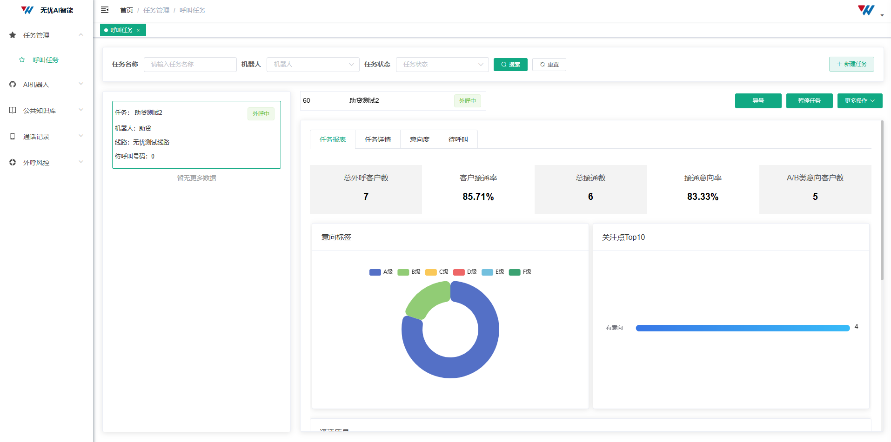
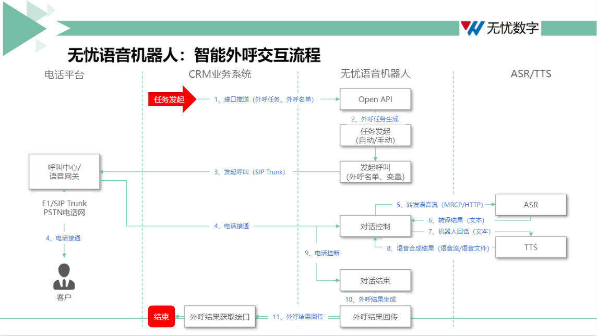

# **AI外呼系统**

#### 介绍
AI外呼系统，基于自然语言处理（NLP）、语音识别（ASR）、语音合成（TTS）和通讯（freeswitch）技术，实现自动语音应答，听说状态的实时切换，用自然逼真的对话与客户沟通。

## 前端展示

## 外呼过程

## 演示环境
文档地址:  https://www.yuque.com/wangwei-w4y9b/og0lou/acmslvtykl7f8c3b

# [## **申请使用**](https://wenjuan.feishu.cn/m?t=scY1j6qRoQZi-tqed)

